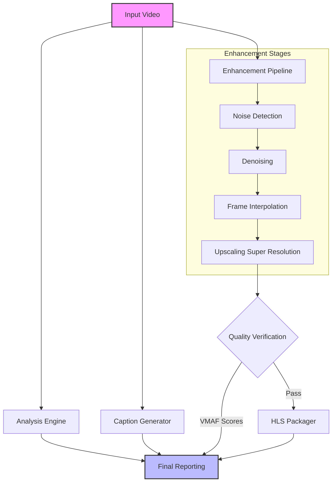

# Lucera: Advanced Video Processing Pipeline

Lucera is a comprehensive, modular video processing pipeline designed to analyze, encourage, and package video content for optimal delivery. It integrates state-of-the-art computer vision analysis, AI-powered captioning, video enhancement techniques, and adaptive bitrate packaging into a single, cohesive workflow.

## Pipeline Architecture

The following diagram illustrates the data flow through the Lucera pipeline:



## Features

Lucera provides a suite of advanced features categorized by their stage in the pipeline:

### 1. Video Analysis
*   **Metadata Extraction**: Detailed technical specifications (codec, bitrate, resolution).
*   **Scene Detection**: Intelligent identifying of scene changes.
*   **Quality Metrics**: Analysis of blur, noise, motion, and complexity levels.

### 2. AI Captioning
*   **Whisper Integration**: Uses OpenAI's Whisper model for high-accuracy speech-to-text.
*   **Multi-Format Output**: Generates both SRT (SubRip) and VTT (WebVTT) subtitle formats.
*   **Audio Processing**: Handles audio extraction and management automatically.

### 3. Video Enhancement
*   **Upscaling**: AI-based super-resolution to increase video clarity and resolution (4x scale).
*   **Frame Interpolation**: Increases frame rate (e.g., to 60fps) for smoother motion using RIFE/AI techniques.
*   **Denoising**: Adaptive noise reduction to clean up grainy footage while preserving edges.

### 4. Adaptive Packaging
*   **HLS Generation**: Creates HTTP Live Streaming (HLS) master and variant playlists.
*   **Adaptive Bitrate**: Generates multiple quality levels to ensure smooth playback across different network conditions.

### 5. Quality Assurance
*   **VMAF Verification**: Calculates VMAF (Video Multimethod Assessment Fusion), PSNR, and SSIM scores to objectively verify that the enhanced video maintains or improves visual quality compared to the original.

## Getting Started

### Prerequisites

*   **Python 3.8+**
*   **FFmpeg**: Must be installed and accessible in your system path.
*   **External Binaries** (Required for Enhancement):
    *   `rife-ncnn-vulkan`: For frame interpolation.
    *   `realesrgan-ncnn-vulkan`: For upscaling.
    *   *Note: If these are not found in your PATH, enhancement steps will be skipped.*
*   **CUDA (Optional)**: Recommended for faster AI processing.

### Installation

1.  Clone the repository:
    ```bash
    git clone https://github.com/PranavViswanathan/Lucera.git
    cd Lucera
    ```

2.  Create and activate a virtual environment:
    ```bash
    python -m venv env
    source env/bin/activate  # On Windows: env\Scripts\activate
    ```

3.  Install dependencies:
    ```bash
    pip install -r requirements.txt
    ```

## Docker Usage

## Docker Usage

### Automated (Recommended)
We provide a shell script to automate the Docker workflow.

1.  **Make executable** (first time only):
    ```bash
    chmod +x lucera.sh
    ```

2.  **Run a video**:
    ```bash
    ./lucera.sh run path/to/video.mp4
    ```

3.  **Other commands**:
    *   `./lucera.sh build`: Rebuild the image manually.
    *   `./lucera.sh stop`: Stop a running process.
    *   `./lucera.sh clean`: Remove images to free space.

### Manual
If you prefer running Docker commands yourself:

1.  **Build**:
    ```bash
    docker build -t lucera .
    ```

2.  **Run**:
    ```bash
    docker run -v $(pwd):/data lucera /data/video.mp4
    ```

## Usage

To process a video locally (without Docker), run the `src/main.py` script:

```bash
python src/main.py /path/to/your/video.mp4
```

### Outputs

The pipeline generates various artifacts organized in the `src/utility_classes/` logic:

*   **Captions**: `src/utility_classes/caption_results/` (SRT/VTT files)
*   **Enhanced Video**: `src/utility_classes/video_enhancers/output/`
*   **Analysis Data**: `src/utility_classes/analysis_results/`
*   **Final Reports**: `src/utility_classes/complete_pipeline_results/`

## Directory Structure

```
Lucera/
├── sr/
│   ├── main.py                 # Entry point
│   └── utility_classes/        # Core modules
│       ├── video_analysis.py   # Analysis engine
│       ├── caption_generation.py # Whisper integration
│       ├── video_enchancers.py # Upscaling/Denoising/Interpolation
│       ├── packaging_generator.py # HLS packaging
│       └── VMAF.py             # Quality verification
├── env/                        # Virtual environment
└── README.md                   # Documentation
```